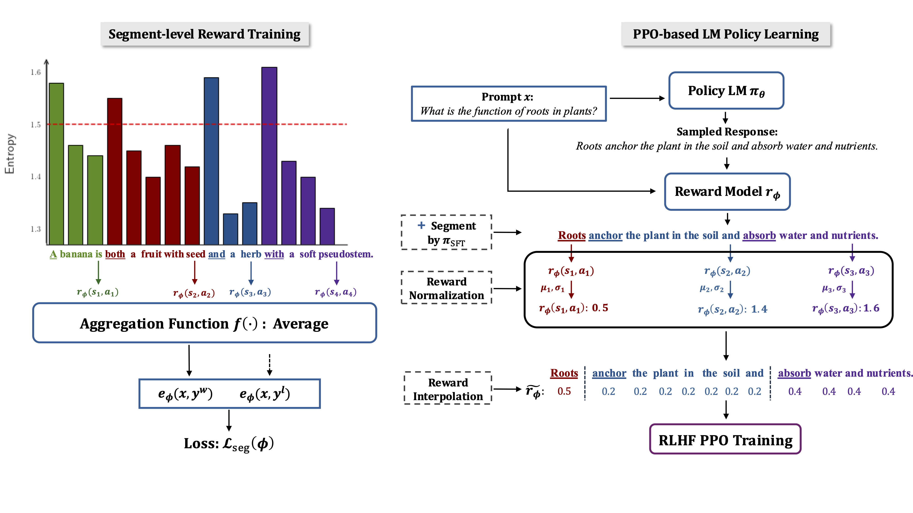

# 🔥 Denser Reward for RLHF PPO Training 🔥

This repository contains the code and released models for our paper [Segmenting Text and Learning Their Rewards for Improved RLHF in Language Model](urlXXXXXXXXXXXX).
We study the granularity of action space in RLHF PPO training, assuming only binary preference labels.
Our proposal is to ${\color{lightgreen} \textsf{assign reward to each semantically complete text segment}}$, rather than [per-token](https://arxiv.org/pdf/2306.00398) (maybe over-granular 😭) or bandit reward (sparse 😭).
We further ${\color{lightgreen} \textsf{design techniques to ensure the }}$ ${\color{lightgreen} \textsf{effectiveness and stability of RLHF PPO training under the denser \\{segment-level, token-level\\} rewards}}$. 


Our ${\color{orange} \textsf{Segment-level RLHF PPO and its Token-level PPO variant outperform bandit PPO}}$ across AlpacaEval 2, Arena-Hard, and MT-Bench benchmarks under various backbone LLMs.
Model checkpoints are available on [HuggingFace](https://huggingface.co/collections/yyqoni/denserewardrlhf-ppo-677d39b5521f1e366c196f14).



## 🔗 Quick Links
- [Denser Reward for RLHF PPO Training](#-denser-reward-for-rlhf-ppo-training-) 
  - [Benckmark Results & Released Models](#benckmark-results--released-models)
  - [Dependency](#dependency)
  - [Training scripts](#training-scripts)
    - [Segment-level RLHF PPO](#segment-level-rlhf-ppo)
    - [Token-level RLHF PPO](#token-level-rlhf-ppo)
    - [Bandit RLHF PPO (Baseline)](#bandit-rlhf-ppo-baseline)
  - [Evaluation](#evaluation)
  - [Citation](#citation)

## Benckmark Results & Released Models


## Dependency
The dependencies for running our repo can be installed by:
```shell
conda create -n denserlhf python=3.10
git clone https://github.com/yinyueqin/DenseRewardRLHF-PPO.git
cd DenseRewardRLHF-PPO
pip install -e .
```

## Training scripts

### Segment-level RLHF PPO

* Backbone Model 1 (Phi-3-mini-instruct-segment):
```shell
# first train reward model
bash examples/scripts/train_seg_rm.sh train_seg_rm phi3-instruct preference_700K 1 peak 1.75 avg 

# then train ppo
bash examples/scripts/train_ppo_segment.sh ppo_segment_rm_training phi3-instruct Ultrafeedback 2 peak 1.75 avg segment_normalization 0.25 preference700k_60000
```

* Backbone Model 2 (rlhflow-llama-v2-segment):
```shell
# first train reward model
bash examples/scripts/train_seg_rm.sh train_seg_rm rlhflow_llama_3_sft_8b_v2 preference_700K 1 peak 2 avg

# then train ppo
bash examples/scripts/train_ppo_segment.sh ppo_segment_rm_training rlhflow_llama_3_sft_8b_v2 Ultrafeedback 1 peak 2 avg segment_normalization 0.25 preference700k_60000

```

* Backbone Model 3 (meta-llama-3.1-segment):
```shell
# first train reward model
bash examples/scripts/train_seg_rm.sh train_seg_rm meta_llama_3_1_instruct_8b preference_700K 1 peak 2 avg

# then train ppo
bash examples/scripts/train_ppo_segment.sh ppo_segment_rm_training_end_penalty_m0d05_len_thres_800 meta_llama_3_1_instruct_8b Ultrafeedback 1 peak 2 avg segment_normalization 0.25 preference700k_60000
```

### Token-level RLHF PPO

* Backbone Model 1 (Phi-3-mini-instruct-token):
```shell
# first train reward model
bash examples/scripts/train_seg_rm.sh train_seg_rm phi3-instruct preference_700K 1 peak 0 avg 

# then train ppo
bash examples/scripts/train_ppo_segment.sh ppo_segment_rm_training phi3-instruct Ultrafeedback 2 peak 0 avg segment_normalization 0.25 preference700k_60000
```

* Backbone Model 2 (rlhflow-llama-v2-token):
```shell
# first train reward model
bash examples/scripts/train_seg_rm.sh train_seg_rm rlhflow_llama_3_sft_8b_v2 preference_700K 1 peak 0 avg

# then train ppo
bash examples/scripts/train_ppo_segment.sh ppo_segment_rm_training_length_norm rlhflow_llama_3_sft_8b_v2 Ultrafeedback 1 peak 0 avg segment_normalization 0.25 preference700k_60000
```

* Backbone Model 3 (meta-llama-3.1-token):
```shell
# first train reward model
bash examples/scripts/train_seg_rm.sh train_seg_rm meta_llama_3_1_instruct_8b preference_700K 1 peak 0 avg

# then train ppo
bash examples/scripts/train_ppo_segment.sh ppo_segment_rm_training meta_llama_3_1_instruct_8b Ultrafeedback 1 peak 0 avg segment_normalization 0.25 preference700k_60000
```

### Bandit RLHF PPO (Baseline)

* Backbone Model 1 (Phi-3-mini-instruct-bandit):
```shell
# first train reward model
bash examples/scripts/train_seg_rm.sh train_seg_rm phi3-instruct preference_700K 1 peak 1000 avg 

# then train ppo
bash examples/scripts/train_ppo_segment.sh ppo_segment_rm_training phi3-instruct Ultrafeedback 2 peak 1000 avg segment_last_avg 0.2 preference700k_60000

```

* Backbone Model 2 (rlhflow-llama-v2-bandit):
```shell
# first train reward model

bash examples/scripts/train_seg_rm.sh train_seg_rm rlhflow_llama_3_sft_8b_v2 preference_700K 1 peak 1000 avg

# then train ppo
bash examples/scripts/train_ppo_segment.sh ppo_segment_rm_training rlhflow_llama_3_sft_8b_v2 Ultrafeedback 1 peak 1000 avg segment_last_avg 0.2 preference700k_60000
```

* Backbone Model 3 (meta-llama-3.1-bandit):
```shell
# first train reward model
bash examples/scripts/train_seg_rm.sh train_seg_rm meta_llama_3_1_instruct_8b preference_700K 1 peak 1000 avg

# then train ppo
bash examples/scripts/train_ppo_segment.sh ppo_segment_rm_training meta_llama_3_1_instruct_8b Ultrafeedback 1 peak 1000 avg segment_last_avg 0.2 preference700k_60000
```

## Evaluation

We follow the evaluation receipts of [AlpacaEval 2](https://github.com/tatsu-lab/alpaca_eval), [Arena-Hard](https://github.com/lm-sys/arena-hard-auto), and [MT-Bench](https://github.com/lm-sys/FastChat).

## Citation
Please cite our paper and prior work on token-level reward model for RLHF if you find this repo helpful in your work:


```angular2html
@misc{yin2025segmentingtextlearningrewards,
      title={Segmenting Text and Learning Their Rewards for Improved RLHF in Language Model}, 
      author={Yueqin Yin and Shentao Yang and Yujia Xie and Ziyi Yang and Yuting Sun and Hany Awadalla and Weizhu Chen and Mingyuan Zhou},
      year={2025},
      eprint={2501.02790},
      archivePrefix={arXiv},
      primaryClass={cs.CL},
      url={https://arxiv.org/abs/2501.02790}, 
}
```

```
@inproceedings{yang2023preferencegrounded,
    title={Preference-grounded Token-level Guidance for Language Model Fine-tuning},
    author={Shentao Yang and Shujian Zhang and Congying Xia and Yihao Feng and Caiming Xiong and Mingyuan Zhou},
    booktitle={Thirty-seventh Conference on Neural Information Processing Systems},
    year={2023},
    url={https://arxiv.org/abs/2306.00398}
}
```

## References & Acknowledgements

This repository builds on the following codebases:

- [OpenRLHF](https://github.com/OpenRLHF/OpenRLHF)
- [Token-level Reward Model for RLHF](https://github.com/Shentao-YANG/Preference_Grounded_Guidance)
